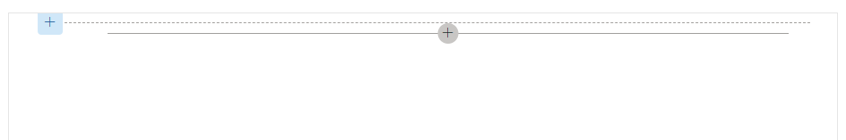
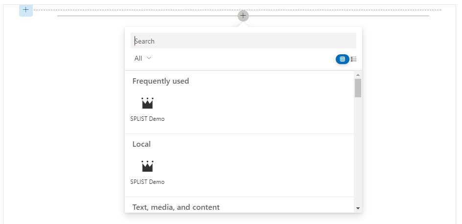

# datatables-jquery-spfx
This repo provides an example of how to integrate jQuery DataTables into a Sharepoint site using SPFx.

## Setup

### Create a SharePoint site.
See [How to create a SharePoint team site](../docs/CREATE_TEAM_SITE.md) for more information.

### Add tenant url to `config/serve.json`.
Open config/serve.json, replace `initialPage` with a link to the SharePoint site you just created, e.g. `https://mytenant.sharepoint.com/sites/DataTablesSPFXIntegration`. This needs to be done to in order to preview the site.

## Install
From the `mainejsspfx` root, type `cd datatables-jquery-spfx` then `npm install`. All dependencies will be installed.

Note the scaffolding in this example is "no framework". No framework just creates the minimum amount of code needed to run a sharepoint app.

## Preview changes
1. Run `gulp serve`. Wait for the workbench to open in a new window.<br />
2. Click the `+` icon at the top of the workbench, wait until you see a `Local` section with the name of your WebPart. If you do not see `Local` refresh page.<br/><br/>Note you can rename this icon in the `datatables-jquery-spfx\src\webparts\datatablesJQuerySpFx\DatatablesJQuerySpFxWebPart.manifest.json` file.
3. Click the icon in the Local Section. A preview of the app will load.

## Publish
See [How to publish a WebPart](../docs/PUBLISH_APP.md) for more information.

## Noteable directory files
1. config/config.json
Add any external CDN's like jQuery / DataTables CDN's to the `externals` object.

2. datatables-jquery-spfx\src\webparts\datatablesJQuerySpFx\DatatablesJQuerySpFxWebPart.ts
Importing any CDN added to the config.json externals object is easy. Just import them by the config `globalName`.
```
import 'jquery';
import 'datatables.net';
```

Add datatables html must be in the template string assigned to `this.domElement`. `this.domElement` is a property in `BaseClientSideWebPart` which binds your html to Sharepoint.

The datatables JavaScript is found in `movies.json` and is imported by `require('./movies.js');`.


## References

- [Getting started with SharePoint Framework](https://docs.microsoft.com/en-us/sharepoint/dev/spfx/set-up-your-developer-tenant)
- [Migrate jQuery and DataTables solution built using Script Editor web part to SharePoint Framework](https://learn.microsoft.com/en-us/sharepoint/dev/spfx/web-parts/guidance/migrate-jquery-datatables-script-to-spfx)
- [Microsoft 365 Patterns and Practices](https://aka.ms/m365pnp) - Guidance, tooling, samples and open-source controls for your Microsoft 365 development
