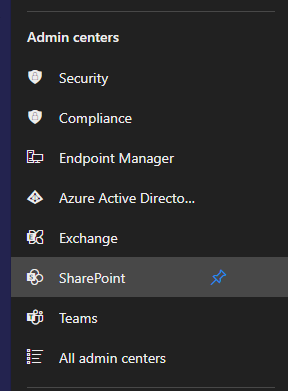

# Create a SharePoint team site.

1. The first step is to get your own free development tenant by subscribing to [Microsoft 365 developer program](http://aka.ms/o365devprogram). The code in this repo was created using a free development tenant.
2. Once you have signed up, login to your developer tenant.
3. Go to the Microsoft 365 Admin center at https://portal.office.com/adminportal/home#/Settings/OrganizationProfile.
4. Click `Show All`<br/><br/>
5. Scroll to the Admin Centers section, click `SharePoint`.<br/><br/>
6. Click `Active Sites`.
7. Click `+Create` then `Team Site`. Enter required info, click Next then Finish.
8. At the active sites menu, click the URL of the new site. The site will open in a new tab.
9. Copy the URL in the address bar, e.g. https://5mx54.sharepoint.com/sites/myTestSite. This the base URL for your site which will be entered into the `config/serve.json` file.<br/>
```
{
    "$schema": "https://developer.microsoft.com/json-schemas/spfx-build/spfx-serve.schema.json",
    "port": 4321,
    "https": true,
    "initialPage": "https://5mx54.sharepoint.com/sites/myTestSite/_layouts/workbench.aspx"
}
```

Use this site to display the code in this repo.
