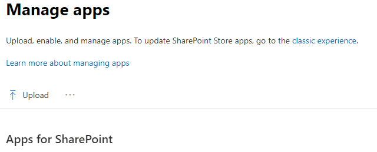
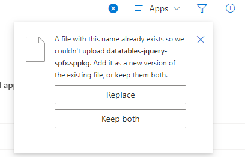
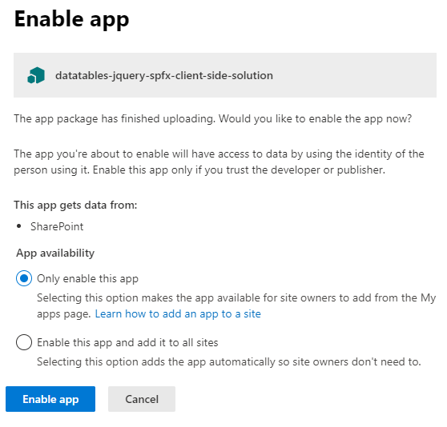
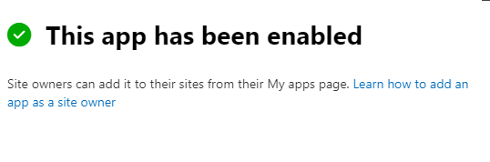
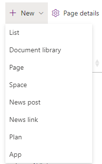
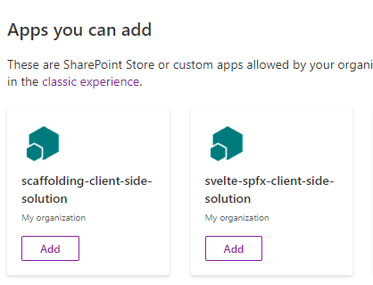
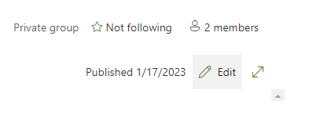
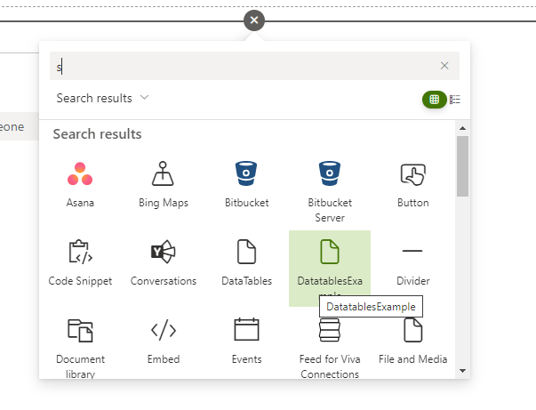
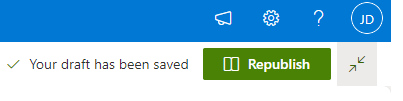

# Publish a SharePoint Solution
This README.md explains how to publish a SharePoint solution file to SharePoint online.

# Pre-build process

## Increment version numbers

### config/package-solution.json
Do not forget to increment the version number in `config/package-solution.json`. 

Before starting the build process, the `solution/version` and `features/version` properties (which are found in `config/package-solution.json`). Best to keep the version numbers the same as well.

### package.json
Update package.json version number as well.

# Build process
To bundle the solution code, type `gulp bundle --ship`. This command compiles the code and replaces what is found in the dist and lib directories.

# Package solution
The next step is to package the solution into a SharePoint solution file (). To create this file type `gulp package-solution --ship`. This command creates a file in the `sharepoint/solution` folder. The file will end with sppkg. To update the name of this file, open `config/package-solution.json`, replace the value of the `zippedPackage` property.

# Upload app to app catalog.
Login to your Microsoft developer tenant then go to the App Catalog. The URL of your app catalog will be something similar to this link: https://<tenant site>/sites/appcatalog/_layouts/15/tenantAppCatalog.aspx/manageApps. Then follow these steps to upload the solution file.

1. Click `Upload`.  
2. Change file explorer to point to the solution file created in previous steps. Click `Open`.   
3. If this dialog appears click `Replace`.  
4. After the upload has completed this modal will appear. Select `Only enable this app` then `Enable App`. .
5. A action completed modal will appear. The App version number of your solution will increment as well. Click `Close`. 

# Add to the SharePoint site
1. Go to the SharePoint site where you would like to install the WebPart. The easiest way to do this is go to the SharePoint admin page for the tenant. 
2. Wait for the My Apps page to load. Select the app you would to add then click `Add`. 
3. When the app has been added the `Add` button will be disabled, label changed to `Added`. 
4. The final step is to add the WebPart to the application. To do this go back to your SharePoint site, click `Edit` in the upper left corner of the page. 
5. Find a place in the page to add your webpart. This may be done the same way as the preview, e.g. click `+` then select an app. 
6. Click `Republish` then go to the home page. Your new app will be published. 

That's it!