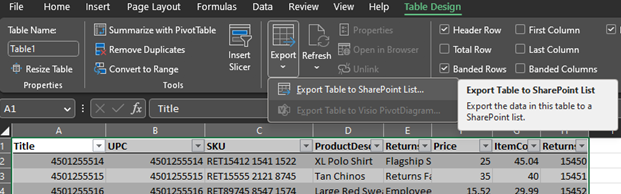
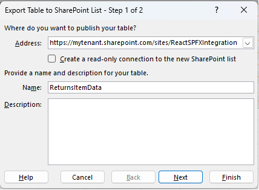
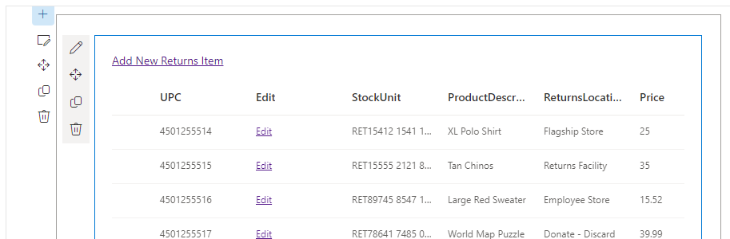

# react-spfx-integration

## Summary
This repo provides an example of how to integrate React into a SharePoint online app using SPFx.

## Setup

### Create a SharePoint site.
See [How to create a SharePoint team site](../docs/CREATE_TEAM_SITE.md) for more information.

### Create a SharePoint list
The code in the React-SPFx integration example also demonstrates how to access a SharePoint list. For this reason you will need to create a SharePoint list in order for the demo to work.

* Open data.xlsx. Wait for the spreadsheet to load.
* Click **Table Design** in the top navigation menu. Then click **Export**, **Export Table to SharePoint** List. 

* Wait for the export table to SharePoint list modal to open. For Address type in your SharePoint address site, e.g. https://mytenant.sharepoint.com/sites/ReactSPFXIntegration. For name type **ReturnsItemData**. Click **Next**. 

* If excel is not signed into SharePoint you will be redirected to the OAuth2 sign in screens. Enter in your tenant username, tenant password and security code from the authenticator app. After this is done this summary modal will appear. Click **Finish**. Your list will be exported to SharePoint.
* Go back to the SharePoint site, refresh the page then click Site Contents. A list named *ReturnsItemList* will be visible.

### Add tenant url to `config/serve.json`.
Open config/serve.json, replace `initialPage` with a link to the SharePoint site you just created, e.g. `https://mytenant.sharepoint.com/sites/ReactSPFXIntegration`. This needs to be done to in order to preview the site.

## Install
From the `mainejsspfx` root, type `cd react-spfx` then `npm install`. All dependencies will be installed.

## Preview changes
1. Run `gulp serve`. Wait for the workbench to open in a new window. 
2. Click the `+` icon at the top of the workbench, wait until you see a `Local` section with the name of your WebPart. If you do not see `Local` refresh page.  Note you can rename this icon in the `react-spfx\src\webparts\returnsApp\ReturnsAppWebPart.manifest.json` file.
3. Click the icon in the Local Section. A preview of the app will load. .

## Publish
See [How to publish a WebPart](../docs/PUBLISH_APP.md) for more information.

## Directory structure

### config 
Contains configuration files.
* serve.json - Point initialPage to your tenant to preview using `gulp serve`.
* package-solution.json - Every time you upload a new version of your WebPart, you must change the solution's version number. This is found in the solution object. SharePoint will not like it if you upload a new WebPart without incrementing the version.

### src
This is where the webparts code is stored. This directory may be broken up into many different parts. 
1. api - API to interact with a SharePoint list.
2. assets - images, any static assets.
3. components - Place for React components.
4. models - Place for interfaces.
5. services - This is where the ContextService lives. The context service allows you to access the SharePoint page context object in any React component or TypeScript file. ContextService allows you to avoid "prop drilling".
6. utils - Helper function like `createRandomItem.ts`.
7. ReturnsAppWebPart.ts - This is the main file created by the yeoman generator. This is where you bind your React components to SharePoint, add onload methods and other misc. tasks.

## References
-   [Getting started with SharePoint Framework](https://docs.microsoft.com/en-us/sharepoint/dev/spfx/set-up-your-developer-tenant)
-   [FluentUI Controls](https://developer.microsoft.com/en-us/fluentui#/controls/) - Provides API for FluentUI components.
-   [FluentUI Home Page](https://developer.microsoft.com/en-us/fluentui#/) - Home page for FluentUI. 
-   [Building for Microsoft teams](https://docs.microsoft.com/en-us/sharepoint/dev/spfx/build-for-teams-overview)
-   [Use Microsoft Graph in your solution](https://docs.microsoft.com/en-us/sharepoint/dev/spfx/web-parts/get-started/using-microsoft-graph-apis)
-   [Publish SharePoint Framework applications to the Marketplace](https://docs.microsoft.com/en-us/sharepoint/dev/spfx/publish-to-marketplace-overview)
-   [Microsoft 365 Patterns and Practices](https://aka.ms/m365pnp) - Guidance, tooling, samples and open-source controls for your Microsoft 365 development

## Disclaimer
**THIS CODE IS PROVIDED _AS IS_ WITHOUT WARRANTY OF ANY KIND, EITHER EXPRESS OR IMPLIED, INCLUDING ANY IMPLIED WARRANTIES OF FITNESS FOR A PARTICULAR PURPOSE, MERCHANTABILITY, OR NON-INFRINGEMENT.**
